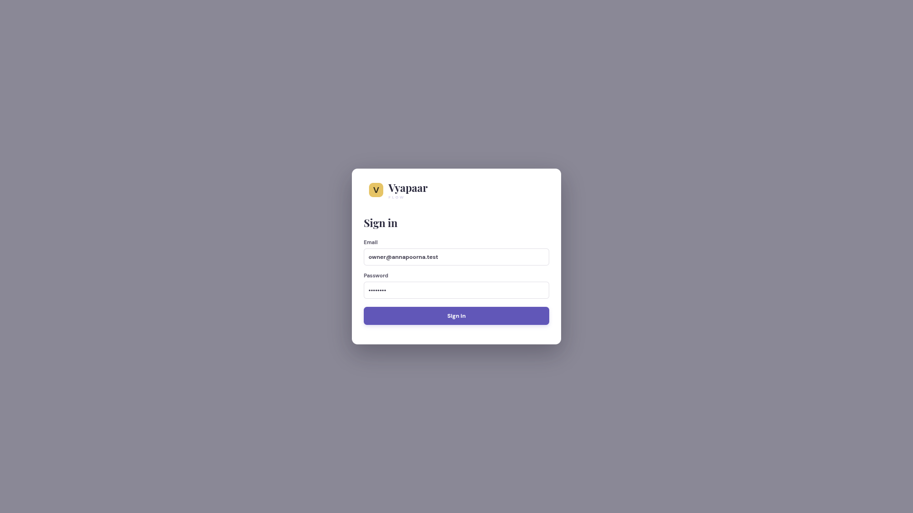
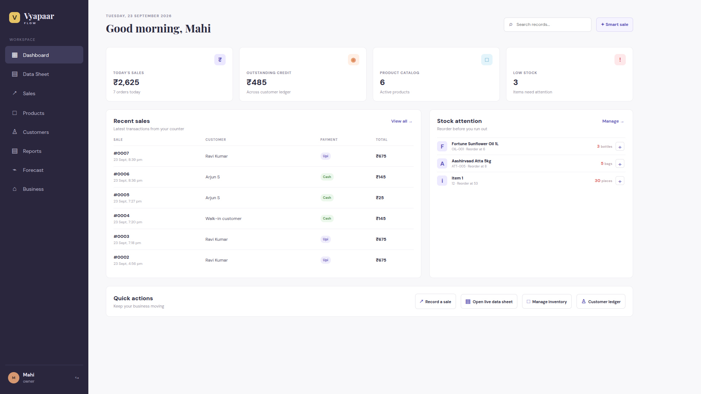
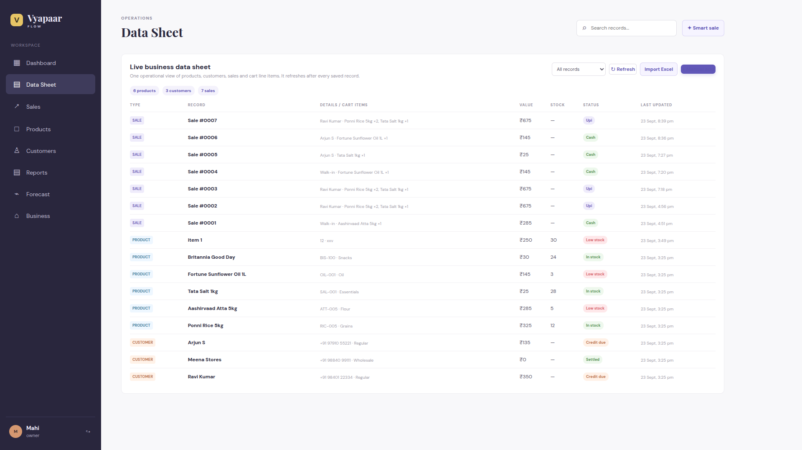
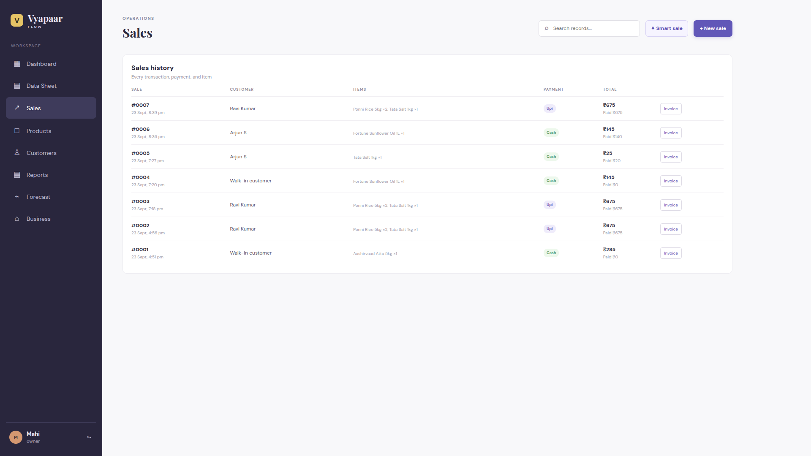
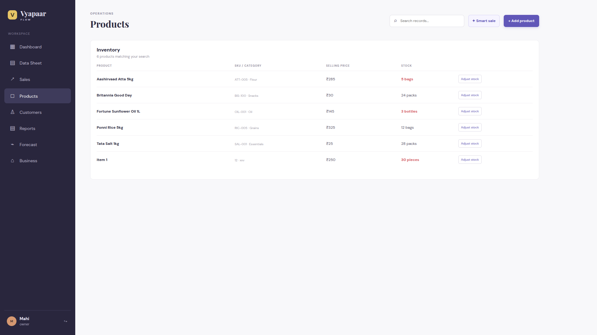
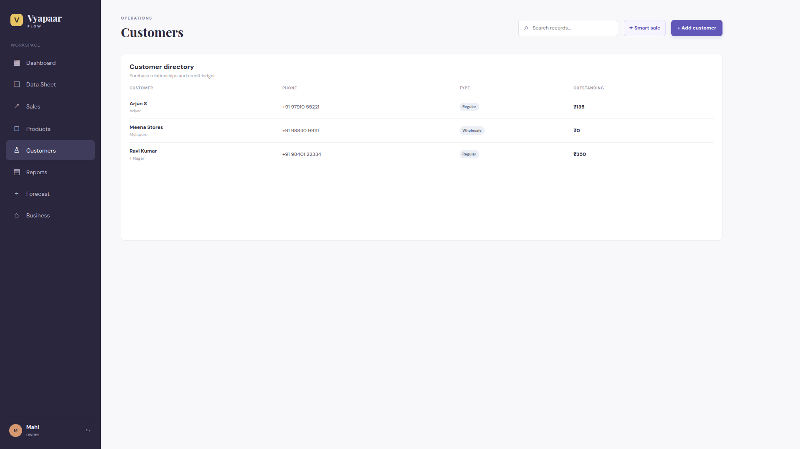
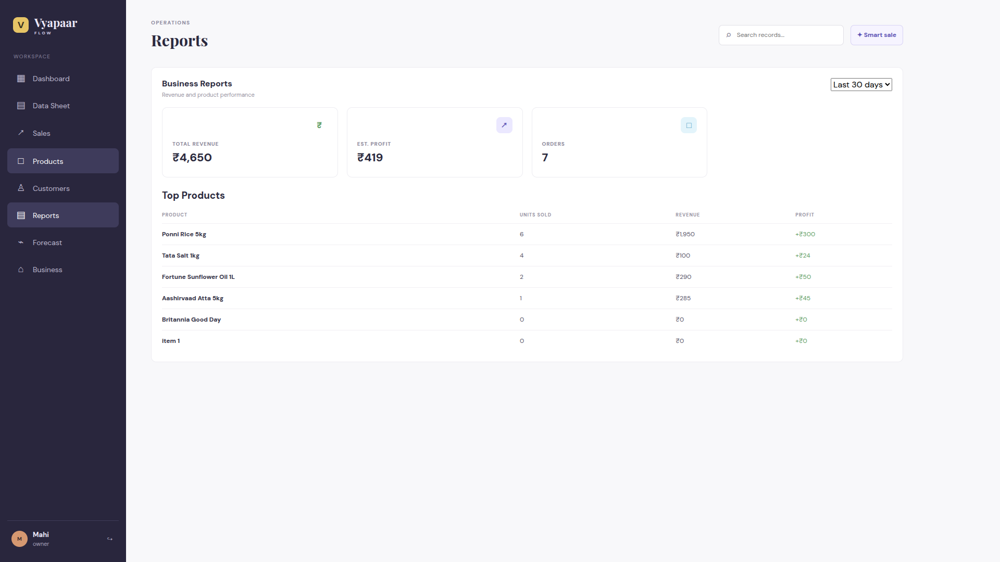
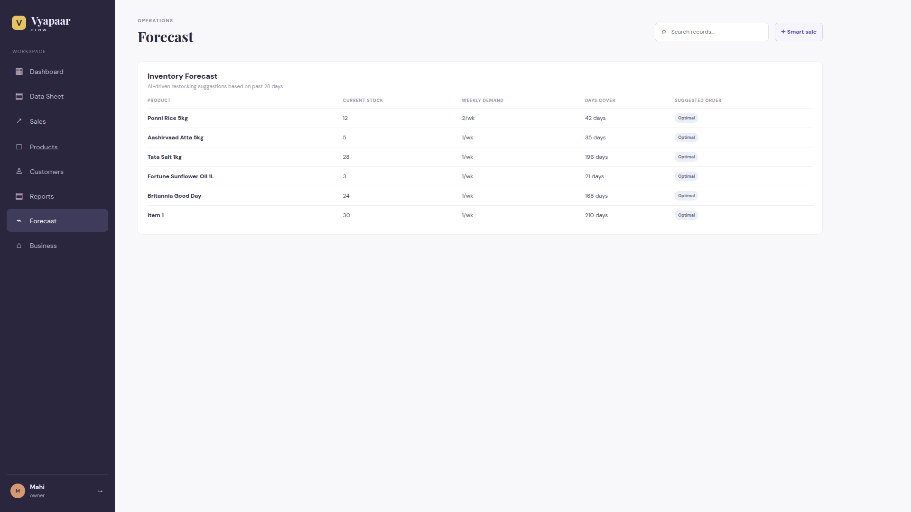
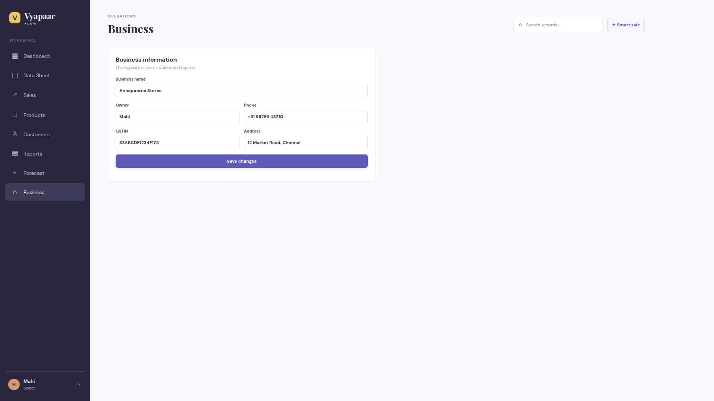

# Vyapaar Flow

A small-business management MVP for products, customers, sales, inventory, and business information.

## Run locally

```bash
npm install
npm run dev
```

Open `http://localhost:5173`. The Express API runs at `http://localhost:3001` and automatically creates `business.db` with demo data on first start.
## Demo sign-in

- Owner: `owner@annapoorna.test` / `owner123`
- Cashier: `cashier@annapoorna.test` / `cashier123`

The database is owned by the Node API and uses Node's built-in SQLite module, so no native SQLite module compilation is required.











